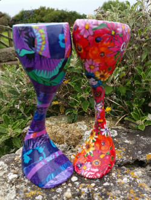
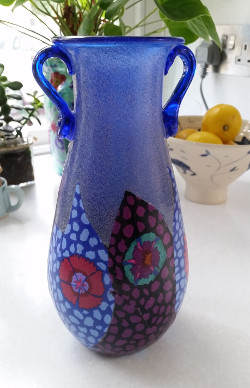
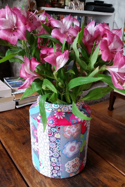

## Colour and joy go together for me. Bold, strong, expressive coloured fabrics are what I love using when I create my upcycled objects. It is not surprising therefore that most of the work the other artists on display in UpstArt Gallery (mosaics, feltings, paintings, paper collages, pottery, and textiles) is also colourful and joyous.  

We also share a preference for working with recycled materials: the fabric, china, paper, silver, wool, wood, copper, lead, leather etc. that we use in our work is mostly sourced from charity shops, car boots and auctions. Where this is not possible, each artist tries to ensure that their materials come from ethical sources.

The fashion is all for furniture to be painted in soft, muted colours, blank canvas houses, plain interiors, tasteful white and beige lampshades….. You might really like that or you might be renting or want to resell one day and so you cannot let your inner joyous bohemian out on the fabric of the building. But  sometimes it is just something colourful like a simple chair, a table, lampshade, painting, mosaic, rug or vase  that could brighten up the room and add spice to the neutral background. 

So look at my website and what UpstArt does, and if anything takes you fancy or you would like to discuss a commission , email or phone me. Just imagine…….

*Under construction: Studio/Gallery to open at the end of October/beginning of November.*

 

