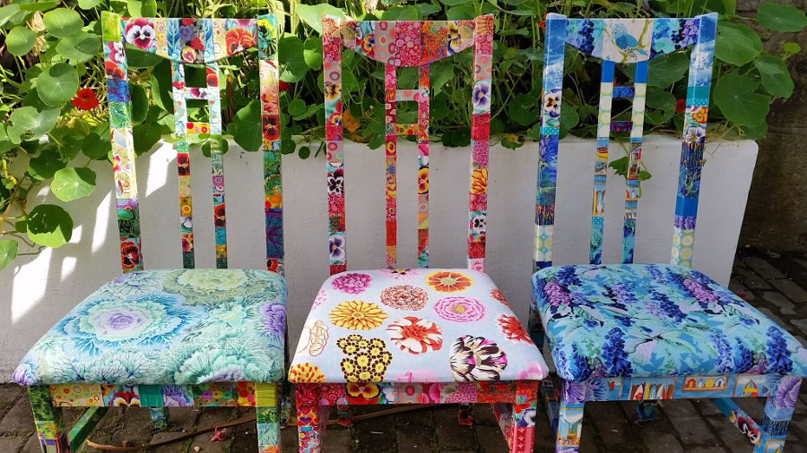
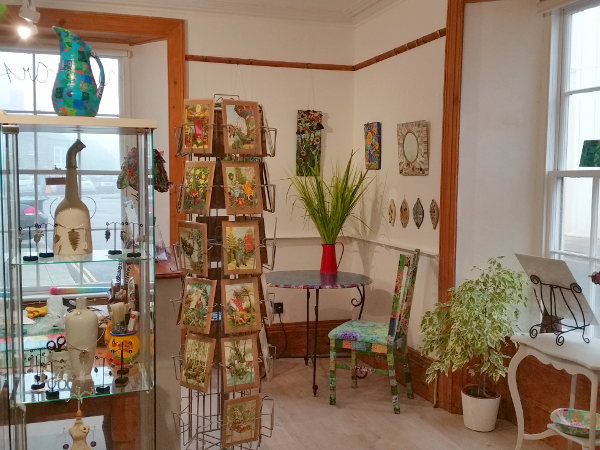
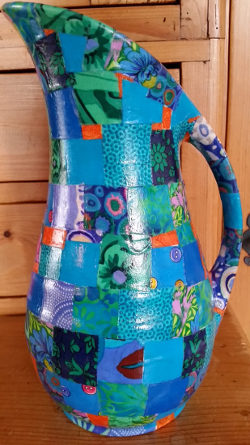

Colour and joy go together for me. Bold, strong, expressive coloured fabrics are what I love using to create my upcycled objects. It is not surprising therefore that most of the work of the other artists on display in UpstArt Gallery (mosaics, feltings, paintings, paper collages, pottery, textiles and cards) is also colourful and joyous.

The opening hours are as follows:

* Wednesdays: 11am to 5pm
* Thursdays: 11am to 5pm
* Fridays:   11am to 5pm
* Saturdays: 11am to 5pm
* Closed on Sundays, Mondays and Tuesdays

I look forward to welcoming you into the shop/studio.

 

